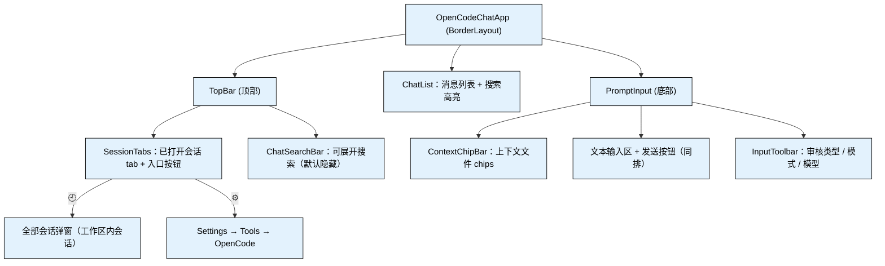

# TSD-07-主界面布局设计

> 适用范围：opencode-idea-panel 工具窗主界面（顶部会话 tab 栏 / 中部消息区 / 底部输入与工具条 / 设置入口）的最终布局方案、组件职责与接线规格。
> 关联文档：设置页见《TSD-05-设置管理设计》第 3 章；实时事件流见《TSD-06-事件流接入设计》。

## 修订历史
| 版本 | 日期 | 变更说明 | 作者 |
|------|------|---------|------|
| v1.0 | 2026-09-29 | 初版：确定「顶部会话 tab + 底部输入工具条」三段式布局 | ayongw |

## 1. 结论与总览

主界面采用**三段式垂直布局**，会话组织方式由「左侧常驻列表」改为「顶部已打开会话 tab」：

```
┌───────────────────────────────────────────────────────────────────────┐
│ [会话A ×][会话B ×][会话C ×]              ➕   🕘   🔍   ⚙             │ ← 顶部 TopBar
├───────────────────────────────────────────────────────────────────────┤
│                                                                       │
│                            消息列表（ChatList）                        │ ← 中部
│                                                                       │
├───────────────────────────────────────────────────────────────────────┤
│ [上下文 chips]                                                         │
│ ┌───────────────────────────────────────────────────────────────────┐ │
│ │ 文本输入区                                                          │ │ ← 输入行
│ │                                                             ➤      │ │
│ └───────────────────────────────────────────────────────────────────┘ │
│ 自动审批 ▾   Build ▾   Claude Sonnet 5.5 ▾                            │ ← 输入工具条
└───────────────────────────────────────────────────────────────────────┘
```

关键决策：

| # | 决策 | 采用方案 | 理由 |
|---|------|---------|------|
| 1 | 会话主视图 | 顶部 tab 栏（Trae 式） | 会话数量多时左侧列表挤占消息宽度；tab 更贴近多会话并行使用习惯 |
| 2 | 全部会话入口 | 顶部 🕘 弹窗，按工作区过滤 | 「当前工作区的会话」才是有效上下文，跨目录会话不应混入 |
| 3 | 设置入口 | 顶部右侧齿轮（保留 IDE 原生 Settings 入口） | 与「打开设置」动作就近，避免用户翻菜单 |
| 4 | 发送按钮 | 输入框右侧（不在工具条行内） | 发送是高频动作，与输入区同侧便于「输入 → 发送」视线连贯 |
| 5 | 底部工具条 | 审核类型 / 模式 / 模型 三个下拉 | 对齐 AI Coding 工具通用布局；三者均为「发送前可调」的会话参数 |
| 6 | 左侧列表面板 | 移除（组件复用为弹窗内容） | 与顶部 tab 重复；保留 `SessionList` 作为弹窗内容，避免重复实现 |

## 2. 组件结构



组件职责与文件：

| 组件 | 文件 | 职责 |
|------|------|------|
| `OpenCodeChatApp` | `chatApp/OpenCodeChatApp.kt` | 三段式装配、订阅 ViewModel 状态、弹窗与设置入口编排 |
| `TopBar` | `chatApp/ui/TopBar.kt` | 顶部容器：会话 tab 栏 + 可展开搜索栏 |
| `SessionTabs` | `chatApp/ui/SessionTabs.kt` | 已打开会话 tab（选中/关闭/右键菜单）+ 新建/全部会话/搜索/设置入口 |
| `SessionList` | `chatApp/ui/SessionList.kt` | 工作区内会话列表（新建/重命名/删除），现作为「全部会话」弹窗内容 |
| `ChatList` | `chatApp/ui/ChatList.kt` | 消息渲染、搜索高亮与滚动定位 |
| `PromptInput` | `chatApp/ui/PromptInput.kt` | 输入区容器：chips / 输入行（文本区 + 发送）/ 工具条行 |
| `InputToolbar` | `chatApp/ui/InputToolbar.kt` | 底部三个下拉：审核类型、模式（agent）、会话模型 |
| `ApprovalMode` | `chatApp/viewmodel/ApprovalMode.kt` | 审核类型枚举（本地状态） |

> 原 `ChatHeader.kt`、`ChatToolbar.kt` 已删除，其职责分别并入 `SessionTabs` 与 `TopBar`。

## 3. 交互规格

### 3.1 顶部会话 tab

| 交互 | 行为 |
|------|------|
| 单击 tab | 切换会话（`ChatViewModel.switchSession`），并把该会话加入已打开列表 |
| `×` | 关闭 tab：仅从已打开列表移除，**不删除**会话数据 |
| 右键 tab | 「关闭 / 关闭其他」（仅当存在其他已打开 tab） |
| ➕ | 新建会话（`createSession(null)`），成功后自动加入 tab |
| 🕘 | 打开「全部会话」弹窗 |
| 🔍 | 展开/收起搜索栏（状态与 ChatList 高亮联动） |
| ⚙ | 打开设置页（`ShowSettingsUtil.showSettingsDialog`，定向到 OpenCode 设置） |

tab 标题超过 24 字符截断显示，完整标题放 tooltip；当前 tab 用强调色下边框 + 底色区分。

### 3.2 全部会话弹窗

- 数据源：`allSessionsFlow` 过滤 `session.location.directory == project.basePath`（`directory` 为空则不参与过滤，避免旧数据被隐藏）
- 容量：宽 400 / 高 460，点击外部关闭，再次点击 🕘 会先取消已存在弹窗
- 列表内支持：新建会话、重命名、删除（复用 `SessionList` 既有交互）

### 3.3 底部输入区与工具条

| 元素 | 规格 |
|------|------|
| 布局 | 输入行 = 文本区（CENTER）+ 发送按钮（EAST）；工具条行独占一行（SOUTH） |
| 工具条按钮样式 | 无边框、透明背景、非焦点组件（不产生焦点环）、悬停高亮；文字后带 `▾` |
| 下拉菜单 | 向上弹出（工具条位于窗口底部），选中项带单选标记；列表为空时显示 `Loading...` 占位 |
| 数据加载 | 每次打开下拉前触发 `loadAgentsAndModels()`，避免"点了没反应" |
| 快捷键 | 保持既有：Enter 发送、Shift+Enter 换行、↑/↓ 输入历史、F3 / Shift+F3 搜索结果跳转 |

## 4. 底部三按钮的数据接线

```mermaid
flowchart LR
    classDef ui fill:#e3f2fd,color:#000000,stroke:#000000
    classDef be fill:#e3f2fd,color:#000000,stroke:#000000
    classDef api fill:#e3f2fd,color:#000000,stroke:#000000

    A["InputToolbar 下拉"]:::ui --> B["ChatViewModel"]:::ui
    B --> C["ChatRepositoryApi (前端接口)"]:::ui
    C --> D["ChatRepositoryRpcApi (shared RPC)"]:::ui
    D --> E["BackendChatRepositoryModel"]:::be
    E --> F["OpenCodeRestClient"]:::be
    F --> G["opencode server /api/*"]:::api
```



| 按钮 | v2 端点 | 生效范围 | 说明 |
|------|---------|---------|------|
| 模式 | `GET /api/agent` + `POST /api/session/{sessionID}/agent` | 会话级 | 仅列 `mode=primary` 且非 hidden 的 agent；subagent 由 `@` 调用，不作为模式 |
| 模型 | `GET /api/model` + `POST /api/session/{sessionID}/model` | 会话级 | 请求体 `{"model":{"providerID":...,"id":...}}` |
| 审核类型 | 无对应端点 | 本地状态 | opencode v2 无会话级审批策略端点（策略位于 opencode config 的 `permission` 字段），当前仅前端三档枚举 |

切换失败时不更新选中态（`runCatching` 只在成功后回写），避免 UI 与服务端不一致。

## 5. 状态与持久化

| 状态 | 位置 | 持久化 |
|------|------|--------|
| 已打开会话 tab | `ChatViewModel.openedSessionIds` | 否（重启后为空，仅展示当前会话） |
| 选中 agent / 模型 | `ChatViewModel.selectedAgentId` / `selectedModel` | 否；首次打开下拉时取列表首项 |
| 审核类型 | `ChatViewModel.approvalMode` | 否（默认 `AUTO`） |
| 会话/消息/权限 | 后端 `BackendChatRepositoryModel` | 以 opencode server 为准 |

## 6. 已知缺口与后续

1. **审核类型未真正生效**：待接入 opencode config 的 `permission` 写入能力（见《TSD-05-设置管理设计》的配置定点写入）后，把三档枚举映射为实际策略。
2. **新建会话未绑定工作区**：`POST /api/session` 未传 `location.directory`，会话落在 server 启动目录；应传当前项目 `basePath`。
3. **tab / agent / model 未按会话回读**：切换会话后底部显示的是全局选中值，未回读该会话自身的 agent/model。
4. **无 text 片段的 assistant 消息**：仅有 tool / reasoning 片段时渲染为空内容（存在空气泡风险）。
5. **实时流未接**：消息仍为对账式拉取，见《TSD-06-事件流接入设计》。

## 7. 验证方式

- 构建与单测：`./gradlew test`、`./gradlew buildPlugin --no-daemon --no-configuration-cache`
- 契约单测：`OpenCodeRestClientUnitTest` 覆盖 agent/model 列表解析与 `switchAgent` / `switchModel` 的路径与请求体
- 手工冒烟（需沙箱 IDE，Swing 布局无法无头验证）：
  1. 打开工具窗 → 顶部 tab 是否有当前会话
  2. 发一条消息 → 切模型（选非默认）→ 切模式 → 会话是否按新模型/模式继续
  3. 关闭 tab → 从 🕘 找到该会话并重新打开
  4. 顶部 ⚙ 是否直达设置页；🕘 弹窗是否只列当前工作区会话