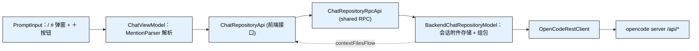

# TSD-08-输入区与上下文交互设计

> 适用范围：idea-agent-panel 主界面**输入区**的上下文获取与参数选择——`/` 触发命令/技能/规则选择、`#` 触发工作区文件与目录选择、附件按钮选择本机任意文件，以及底部的**模式（Build/Plan）**与**模型（按供应商分组 + 筛选）**选择。
> 关联文档：布局与组件职责见《TSD-07-主界面布局设计》；设置读写（供应商/模型/技能配置来源）见《TSD-05-设置管理设计》；事件流见《TSD-06-事件流接入设计》。
> 服务端契约依据：本机 opencode v2.0.18 实例导出的 `openapi.json`（115 个端点）实测。

## 修订历史
| 版本 | 日期 | 变更说明 | 作者 |
|------|------|---------|------|
| v1.0 | 2026-09-29 | 初版：确定输入区 mention（`/`、`#`）+ 附件按钮 + 会话级上下文附件模型；模式默认 Build 与按会话回读；模型弹窗按供应商分组与筛选；给出 S1–S6 实施阶段 | ayongw |
| v1.1 | 2026-09-29 | 输入区形态改为「**内嵌纯文本 mention**」：mention 以 `/name`、`#相对路径` 文本留在输入框内，发送时解析为结构化附件；chips 改为「文本 mention 投影 + 附件按钮会话级附件」两段；放弃内嵌 pill（改动面见 §2.5） | ayongw |
| v1.2 | 2026-09-29 | S1–S6 落地回填（§13）：mention 触发/候选弹窗与解析、会话附件与 ＋ 按钮、命令分支发送、模式默认 Build 与按会话回读、模型弹窗（供应商分组 + 搜索 + 免费 + 管理入口）；`location` 参数按 deepObject 形式落定；补 3 个单测类 | agent |

## 1. 结论与总览

输入区从「纯文本框」升级为「**可 mention 的输入区**」：在输入框内键入 `/` 或 `#` 触发候选弹窗，选中后以**纯文本 mention** 落回文本框（`/sprint-audit`、`#src/main/kotlin/...`）；发送时解析 mention 为结构化附件（files / skills / 命令）随请求下发。附件按钮（＋）选择的**本机任意文件**走会话级附件，与文本 mention 并行。

```
┌───────────────────────────────────────────────────────────────────────┐
│ [会话A ×][会话B ×]                            ➕   🕘   🔍   ⚙        │
├───────────────────────────────────────────────────────────────────────┤
│                            消息列表（ChatList）                        │
├───────────────────────────────────────────────────────────────────────┤
│ 上下文：[/sprint-audit] [src/main/kotlin/…] │ [+ /tmp/report.pdf ×]     │← 左=文本投影 右=＋附件
│ ┌───────────────────────────────────────────────────────────────┐     │
│ │ 使用 /sprint-audit #src/main/kotlin 审核当前结构          ➤   │     │← mention 为纯文本
│ └───────────────────────────────────────────────────────────────┘     │
│ ＋  自动审批 ▾   Build ▾   Nemotron 3 Ultra Free ▾                    │
└───────────────────────────────────────────────────────────────────────┘
```

关键决策：

| # | 决策 | 采用方案 | 理由 |
|---|------|---------|------|
| 1 | 输入区形态 | **内嵌纯文本 mention**（`JBTextArea` 不动） | 保留 Enter 发送 / Shift+Enter 换行 / ↑↓ 历史 / 高度自适应 / IME 等既有行为，无需换编辑器组件；内嵌 pill 的成本见 §2.5 |
| 2 | mention 的文本形态 | `/命令名`、`/技能名`、`#相对路径`（规则即 md 相对路径） | 与 Trae 一致，可读、可手打、可手工删改，无需维护 token↔文档区间映射 |
| 3 | 发送时的解析 | 前端解析（有候选表），把结果作为结构化参数传给后端 | 前端已缓存候选（命令/技能/规则/最近文件），解析成附件后随 `sendMessageWithContext` 下发 |
| 4 | ＋ 附件的形态 | **会话级**（后端持有，chips 常驻） | 本机绝对路径不适宜写进文本；复用既有 `addContextFile/removeContextFile/clearContextFiles` 接口 |
| 5 | chips 的职责 | 左段=文本 mention 的**只读投影**（点 × 删文本中该 mention），右段=＋附件的**可删项** | 文本是 mention 的唯一真源，避免"文本删了 chip 还在"的双源不一致 |
| 6 | 上下文的传输形态 | `POST /prompt` 的 `files` / `skills`；命令走 `POST /command` | opencode v2 原生支持附件，无需把文件内容拼进文本 |
| 7 | `/` 候选来源 | `/api/command` + `/api/skill` + `/api/reference` 三类合并分组 | 与需求「命令 / 技能 / 规则」一一对应 |
| 8 | `#` 候选来源 | `/api/fs/find`（搜索）+ `/api/fs/list`（进入目录） | 服务端递归检索已按相关度排序；目录可「进入」也可「选中」 |
| 9 | 模式默认值 | 默认 `build`，顺序 `build → plan → 其余` | 与 Trae/opencode 默认一致；不依赖服务端返回顺序 |
| 10 | 模型弹窗 | 组件式弹窗（`JBPopup`）+ 搜索框 + 供应商分组 | 现有 `JPopupMenu + JRadioButtonMenuItem` 无法承载搜索框与分组标题 |
| 11 | 回读时机 | 切换会话后按会话回读 agent/model | 修复 TSD-07 §6.3「底部显示全局选中值」的缺口 |

## 2. 输入区交互规格

### 2.1 mention 触发（`/` 与 `#`）

| 项 | 规则 |
|----|------|
| 触发条件 | 光标前的字串满足「行首或前一个字符为空白」且当前字符为 `/` 或 `#`；URL/路径中的 `/`、`#` 不触发 |
| 触发记录 | 记录 `triggerChar` 与 `triggerOffset`（触发字符在文档中的偏移），用于回删 |
| 过滤 | 触发后继续输入的连续非空白字串作为 `query`；`/` 在本地已加载候选上过滤，`#` 调 `findWorkspaceEntries(query)`（200 ms 去抖） |
| 键盘 | `↑/↓` 移动、`Enter`/`Tab` 确认、`Esc` 或点击外部关闭；弹窗开启期间 `Enter` 不发送消息 |
| 确认落地 | 把文档中 `[triggerOffset, caret)` 的片段替换为 **mention 文本**（§2.2 形态表），光标落在 mention 之后；不写后端、不产生 chip |
| mention 文本 | 命令 `/命令名`、技能 `/技能名`、文件/目录/规则 `#相对路径`；末尾补一个空格，便于继续输入 |
| 空 query 行为 | `/` 直接列出全部候选（分组）；`#` 列出工作区根目录条目（走 `/api/fs/list`） |

### 2.2 `#` 候选：文件与目录

候选来自服务端，均为**工作区相对路径**：

| 来源 | 端点 | 用途 |
|------|------|------|
| 搜索 | `GET /api/fs/find?query=&limit=&location[directory]=<basePath>` | 递归相关度检索，返回文件与目录 |
| 浏览 | `GET /api/fs/list?path=&location[directory]=<basePath>` | `#` 后直接回车 / 选中目录项「进入」时列该目录内容 |

> `location` 在 openapi 中声明为 `style=deepObject`，故按 `location[directory]=<绝对路径>` 传递（已由 `OpenCodeRestClientUnitTest` 断言请求侧格式）；服务端是否据此限定检索根目录待 §12.2 实测。

候选列表条目：

| 元素 | 文件项 | 目录项 |
|------|--------|--------|
| 图标 | 文件图标 | 目录图标 |
| 主文本 | 文件名 | 目录名 |
| 次文本 | 相对路径（父目录） | 相对路径 + `/` |
| 确认行为 | 插入 mention `#相对路径` | 插入 mention `#相对路径/` |
| 进入行为 | — | 双击 / `→` 键 → 以该目录为基准重新列表 |

mention 使用**工作区相对路径**（服务端 `FileSystem.Entry.path` 原样），绝对路径在发送解析时由 `basePath` 拼接（§2.4）。

### 2.3 chips 栏

沿用 [ContextChipBar](../../opencode-frontend/src/main/kotlin/com/ayongw/idea/agentpanel/frontend/chatApp/ui/ContextChipBar.kt)，分为两段，中间用竖线分隔：

| 段 | 来源 | 内容 | 点 × 的行为 |
|----|------|------|------------|
| 左：mention 投影 | 解析当前输入文本（§2.4） | 每个 mention 一枚 chip（含 `/命令名`、`#路径`） | 删除**文本中对应的 mention 片段**（真源在文本） |
| 右：会话附件 | ＋ 按钮 / 会话上下文流 | 本机文件/目录（绝对路径） | 从会话上下文移除（走后端 `removeContextFile`） |

左段为**只读投影**，用户直接在输入框里改文本即可增删；两段任一为空时不显示该段与分隔线；两段皆空时显示现有占位提示 `chat.context.empty`。chips 溢出时横向滚动（`JScrollPane`，`HORIZONTAL_SCROLLBAR_AS_NEEDED`）。

### 2.4 mention 解析规则（发送前）

解析为**纯函数**（可单测），输入「文本 + 候选表」，输出「结构化上下文 + 剔除 mention 后的文本」：

| mention | 判定顺序 | 产物 |
|---------|---------|------|
| `/name` | ①命令表中命中 → 命令（单选，取第一个）②技能表中命中 → `SKILL` 附件 | 命令走 `/command` 端点；技能走 `skills[{id}]` |
| `#path` | ①技能/规则名精确命中 → `SKILL` / `RULE` ②否则按工作区相对路径 → `FILE`（以 `/` 结尾视为 `DIRECTORY`） | `files[{uri,name,description}]`；`uri = file://<basePath>/<path>` |

- 仅识别**行首或空白后**的 `/`、`#`（URL、路径、话题标签不误判）。
- 命中即从发送文本中**剔除该 mention 片段**（结构化字段已承载信息，避免重复）；未命中的 mention 保留为普通文本。
- 同名冲突（命令与技能同名）按上表顺序取命令。
- 结果与 ＋ 附件按 `kind + path` 去重后合并下发。

### 2.5 为什么不直接做内嵌 pill（决策留档）

Trae 的 pill 是 Web 富文本（contenteditable + 自建 token 模型），Swing 无等价物，需自建以下全部能力，故本轮不做：

| 成本项 | 说明 |
|--------|------|
| 组件替换 | `JBTextArea` → `EditorTextField` + `InlayModel`（或 `JTextPane` + `StyledDocument`），并重写 Enter/Shift+Enter/↑↓ 历史、高度自适应、滚动、焦点 |
| token ↔ 文档同步 | 维护 token 的区间映射，插入/删除/粘贴/撤销后校正（`RangeMarker` 可省一半） |
| 原子编辑 | 光标落入 pill 时 BS/Delete 整段删除、跨 pill 选择与复制的语义、IME 组合输入边界 |
| 渲染与主题 | 圆角/底色/图标/基线对齐/tooltip 自绘，并跟随浅色/深色主题 |
| 测试 | 文档编辑类逻辑需要 headless 文档 fixture |

纯文本 mention 保留了全部交互（触发、候选、键盘），且天然支持手打与手工删改；后续若确需 pill，只替换渲染层，§2.4 的数据模型与解析器可复用。

## 3. 上下文数据模型与接线

### 3.1 数据模型（shared）

复用既有 `ContextFileDto` 并**新增两个字段**（都有默认值，向后兼容）：

```kotlin
/** 上下文附件类型 */
@Serializable
enum class ContextKind { FILE, DIRECTORY, SKILL, RULE }

@Serializable
data class ContextFileDto(
    val path: String,           // FILE/DIRECTORY/RULE=绝对路径；SKILL=技能本地路径（可空串）
    val name: String,
    val summary: String = "",   // FILE 可放 description；DIRECTORY 固定 "directory"
    @Serializable(with = LocalDateTimeSerializer::class)
    val addedAt: LocalDateTime,
    val isExplicit: Boolean = true,
    val kind: ContextKind = ContextKind.FILE,   // 新增
    val skillId: String? = null                 // 新增：kind=SKILL 时 opencode 侧技能 id
)
```

单次发送的解析结果（mention 解析产物，不落会话存储）：

```kotlin
/** 随消息下发的上下文（文本 mention 解析结果） */
@Serializable
data class PromptContextDto(
    val attachments: List<ContextFileDto> = emptyList(),
    /** 文本中选中的命令名；null 表示本次走普通 prompt */
    val commandName: String? = null
)
```

模型列表分组（§7 用）：

```kotlin
@Serializable
data class ModelProviderDto(
    val id: String,                       // providerID
    val name: String,                     // 展示名，缺失时回落 id
    val models: List<ModelDto>
)
```

`ModelDto` 新增两个默认值字段：

```kotlin
val providerName: String? = null,   // 由 /api/provider 关联补齐
val free: Boolean = false           // /api/model 的 cost 全为 0
```

### 3.2 发送规则

发送链路改为 `sendMessageWithContext(text, PromptContextDto)`，后端把「本次 mention 解析结果」与「会话附件（＋）」合并后组包：

| 条件 | 端点 | 请求体 |
|------|------|--------|
| `commandName != null` | `POST /api/session/{id}/command` | `{name: commandName, text, files: [...], skills: [...]}` |
| 其余情况 | `POST /api/session/{id}/prompt` | `{text, files: [...], skills: [...]}` |

`files` 由 `FILE / DIRECTORY / RULE` 三类组装：`{uri: file://<path>, name, description: summary}`；`skills` 由 `SKILL` 组装：`{id: skillId}`。

命令为**一次性**：发送成功后前端清空输入框（mention 随文本一起消失），无需后端清理；会话附件在发送失败时保留，便于重试。

### 3.3 前后端接线



| 层 | 变更 |
|----|------|
| shared | `ContextFileDto` 加 `kind`/`skillId`；新增 `ContextKind`、`PromptContextDto`、`ModelProviderDto`、`SessionSelectionDto`、`WorkspaceEntryDto`、`CommandDto`、`ReferenceDto`；RPC 新增 `getContextFilesFlow`、`sendMessageWithContext`、`listCommands`、`listReferences`、`findWorkspaceEntries`、`listWorkspaceDirectory`、`listModelProviders`、`getSessionSelection`；删除未被调用的 `setContextSelection` 与其 DTO |
| backend | `BackendChatRepositoryModel` 增加会话附件存储（`Map<sessionId, List<ContextFileDto>>` + `StateFlow`）并实现 add/remove/clear；`sendMessage` 改为接收 `PromptContextDto`，合并会话附件后按 `commandName` 分支组包；实现上述新 RPC；`listModels` 关联 `/api/provider` 补 `providerName`、解析 `cost` 补 `free`；`listAgents` 按 `build → plan → 其余` 排序 |
| frontend | `PromptInput` 增加 mention 触发/候选弹窗与 `＋` 按钮；新增 `MentionParser`（纯函数）与 `AttachmentPicker`；`ContextChipBar` 改造为「文本投影 + 会话附件」两段；`InputToolbar` 模式/模型弹窗重做；`ChatViewModel` 增加候选缓存、附件增删、mention 解析与会话回读 |

## 4. 附件按钮与任意文件（会话级附件）

| 项 | 规格 |
|----|------|
| 位置 | 工具条行最左（`＋` 图标按钮），与 Trae 一致；不参与焦点环 |
| 行为 | 打开 `JFileChooser`，`selectionMode = MULTI_SELECTION`，`fileSelectionMode = FILES_AND_DIRECTORIES` |
| 落地 | 每个选中项 → 一个 `FILE`（文件）或 `DIRECTORY`（目录）**会话附件**（`addContextFile`），chips 右段展示 |
| 不写文本 | 本机绝对路径不进输入框（路径过长且不可读），仅在 chips 中展示文件名与 tooltip 完整路径 |
| 去重 | 与已有会话附件同 `kind + path` 时不重复添加（保留先添加者） |
| 取消 | 不产生任何附件 |

工作区外的文件同样走此入口（`file://` 绝对路径），服务端能否读取见 §12.2。

## 5. `/` 候选：命令 / 技能 / 规则

| 分组 | 端点 | 条目字段 | 选中落地（mention 文本） |
|------|------|---------|------------------------|
| 命令 | `GET /api/command` | `name`、`description` | `/命令名`（发送时解析为 `/command` 调用；单选，取文本中第一个） |
| 技能 | `GET /api/skill` | `id`、`name`、`description`、`path` | `/技能名`（发送时解析为 `SKILL` 附件） |
| 规则 | `GET /api/reference` | `name`、`path`、`description`、`hidden` | `#规则相对路径`（规则即 Markdown 文件，发送时解析为 `RULE` 附件） |

- 三组各自取数，任一组失败不影响其余分组（失败组显示占位文案）。
- `hidden == true` 的规则不展示。
- 候选按 `query` 对 `name` 与 `description` 模糊过滤（大小写不敏感）。
- 命令与技能同名时按「先命令后技能」判定（§2.4）；规则相对路径以 `basePath` 为基准换算（不在工作区内时展示绝对路径同样可用）。

## 6. 模式切换（Build / Plan）

| 项 | 规格 |
|----|------|
| 数据 | `listAgents()` 已过滤 `!hidden && mode == primary`，无需改动 |
| 排序 | `build` → `plan` → 其余按服务端顺序（后端排序，前端不再排序） |
| 默认值 | 当前会话未选中时取 `build`，无 `build` 则 `plan`，再退化为首项 |
| 切换 | `POST /api/session/{id}/agent`（已实现）；失败不更新选中态（已实现） |
| 回读 | 切换会话后取 `GET /api/session/{id}` 的 `agent` 字段回填选中态；回读失败保留原值 |

## 7. 模型选择（供应商分组 + 快速筛选）

### 7.1 数据

`listModelProviders()` 返回 `ModelProviderDto` 列表：后端以 `GET /api/model` 为主体、`GET /api/provider` 补 `name`，按 `providerID` 分组，组内保持服务端顺序；`free = cost 数组为空或各项 input/output 均为 0`。

### 7.2 弹窗

| 区域 | 内容 |
|------|------|
| 顶部 | 搜索框（占位「搜索模型」），对 `name` / `modelID` / `id` 模糊过滤，实时生效 |
| 主体 | 供应商分组头（`name`）+ 该组模型项；选中项右侧 `✓`；`free` 项带「免费」标签；搜索命中时按模型平铺（弱化分组） |
| 底部 | 「管理模型」→ 打开设置页并定位到 Models Tab（`AgentSettingsConfigurable`，见 §7.3） |
| 交互 | 组件式弹窗（`JBPopupFactory.createComponentPopupBuilder`），向上弹出、点击外部关闭、窗口宽度固定 360 px、最大高度 360 px |
| 空态 | 加载中显示「Loading...」，过滤无结果显示「No results」 |

### 7.3 设置页初始 Tab

`AgentSettingsConfigurable` 增加伴生入口 `openAt(project, tabIndex)`：写一个待选下标，`createComponent()` 时按该下标选中 `JBTabbedPane`，供「管理模型」（Models 为下标 1）复用。

## 8. 状态与持久化

| 状态 | 位置 | 持久化 |
|------|------|--------|
| 文本 mention（命令/文件/技能/规则） | 输入框文本（前端唯一真源，chips 左段是投影） | 否（发送成功后清空输入框） |
| 会话附件（＋ 按钮） | `BackendChatRepositoryModel`（内存 `Map<sessionId, List<ContextFileDto>>`） | 否（IDE 重启丢失，见 §12.3） |
| 选中 agent / 模型 | `ChatViewModel.selectedAgentId` / `selectedModel` | 否；切换会话时按服务端回读 |
| 候选缓存 | 前端（命令/技能/规则一次加载，`#` 按 query 实时查） | 否 |
| 模型分组 | 前端（每次打开弹窗前刷新） | 否 |

## 9. 实施阶段

| 阶段 | 内容 | 验收点 |
|------|------|--------|
| S1 | 上下文通路：`ContextFileDto` 扩字段、`PromptContextDto` + `sendMessageWithContext`、后端会话附件存储 + add/remove/clear + `contextFilesFlow`、chips 两段改造、`＋` 按钮 + `JFileChooser` | 选本机文件 → chips 右段出现 → 发送请求体含 `files` |
| S2 | `#` 工作区文件/目录：`findWorkspaceEntries` / `listWorkspaceDirectory` + mention 触发与候选弹窗（文件插入、目录进入/插入） | 输入 `#` 能搜到文件并插入 mention；目录可进入与插入；chips 左段同步出现 |
| S3 | `/` 命令/技能/规则：`listCommands` / `listReferences`（技能已有）+ 分组候选弹窗 + `MentionParser` + 命令分支发送 | 选命令插入 `/xxx`；发送走 `/command` 且文本中 mention 被剔除；技能/规则走结构化附件 |
| S4 | 模式：默认 `build`、排序、按会话回读 | 新建会话默认 Build；切换会话后模式显示为该会话的 agent |
| S5 | 模型：分组 + 搜索 + 免费标签 + 管理模型入口 + 按会话回读 | 弹窗按供应商分组、可搜索、免费项有标记、选中后切换生效 |
| S6 | 单测补齐、构建与手工冒烟、回填本文档实施状态 | 见 §10 |

## 10. 验证方式

- 单元测试（新增/扩展）：
  - `OpenCodeRestClientUnitTest`：`sendPrompt` 的 `files`/`skills` 请求体、`sendCommand` 请求体与路径、`listCommands` / `listReferences` / `fsFind` / `fsList` / provider 关联与免费判定的响应解析
  - `MentionParserUnitTest`：触发位置判定（行首/空白后触发，URL 内不触发）、命令与技能同名取命令、`#` 路径与规则区分、mention 剔除后的文本、未命中 mention 原样保留
  - `SessionContextAttachmentsUnitTest`：会话附件增删与去重、发送组包（files/skills 合并去重）、命令分支选择与 `commandName` 优先级
  - `ModelGroupingUnitTest`：按 provider 分组、搜索过滤、免费判定、`build→plan` 排序
- 构建：`./gradlew test`、`./gradlew buildPlugin --no-daemon --no-configuration-cache`
- 手工冒烟（需沙箱 IDE，Swing 无法无头验证）：
  1. `＋` 选一个工作区外文件 → chips 右段出现 → 发送 → 服务端能读到该文件
  2. `#` 输入文件名片段 → 插入 `#相对路径` mention → chips 左段同步出现；目录可进入后再插入
  3. 手工删掉输入框里的 `#xxx` → chips 左段同步消失
  4. `/` 选命令 → 插入 `/xxx` → 发送 → 服务端执行命令；技能/规则以结构化附件下发，文本中 mention 已被剔除
  5. 新建会话 → 模式显示 Build；切 `plan` → 切换会话再切回 → 模式回读为 `plan`
  6. 模型弹窗 → 搜索框过滤 → 选择「免费」模型 → 生效；「管理模型」直达设置页 Models Tab

## 11. 服务端能力对照（v2.0.18）

| 用途 | 端点 | 关键字段 |
|------|------|---------|
| 命令清单 | `GET /api/command` | `Command.Info{name, description}`，可带 `location[directory]` |
| 执行命令 | `POST /api/session/{id}/command` | `{name, text, files, agents, skills}`，`name`/`text` 必填 |
| 技能清单 | `GET /api/skill` | `Skill.Info{id, name, description, path, content}` |
| 规则清单 | `GET /api/reference` | `Reference.Info{name, path, description, hidden, source}` |
| 文件检索 | `GET /api/fs/find` | `query` 必填、`type=file\|directory`、`limit` |
| 目录浏览 | `GET /api/fs/list` | `path`（相对 `location[directory]`） |
| 读文件 | `GET /api/fs/read/*` | — |
| 发送消息 | `POST /api/session/{id}/prompt` | `files[FileAttachment{uri,name,description}]`、`skills[SkillAttachment{id}]`、`agents[AgentAttachment{name}]` |
| 模型清单 | `GET /api/model` | `Model.Info{cost[], limit.context, providerID}` |
| 供应商清单 | `GET /api/provider` | `Provider.Info{id, name}` |
| 会话详情 | `GET /api/session/{id}` | `agent`、`model{id, providerID}`、`location.directory` |

## 12. 已知限制与后续

1. **工作区外文件的读取能力**：`FILE` 附件使用 `file://` 绝对路径，服务端是否允许读取工作区外路径未实测；不允许时应给出「请复制到工作区」的提示（S1 实测项，若受限则降级为纯提示）。
2. **目录附件的服务端语义**：目录以 `files[].uri` 传递，opencode 对目录 uri 的处理（列目录 / 仅记录）未实测，S2 落地后按真实验证结果回填本节。
3. **会话附件不持久化**：＋ 按钮加入的会话附件存于内存，IDE 重启后丢失（与「已打开 tab 不持久化」一致）；文本 mention 随输入框文本，本就不跨会话保留。
4. **mention 误判边界**：仅按「行首/空白后 + 命中候选表」判定，不做文件存在性校验（避免每次按键打服务端）；`#不存在的路径` 会被当作普通文本保留而不产生附件。
5. **审核类型仍未真正生效**：沿用 TSD-07 §6.1，待 `permission` 配置写入能力接入。
6. **选区上下文未纳入**：当前文件的选区/当前文件作为自动上下文（`isExplicit=false`）不在本次范围，仅保留字段兼容。

## 13. 实施状态（S1–S6）

| 阶段 | 状态 | 落地内容（关键文件 / 接口） |
|------|------|---------------------------|
| S1 上下文通路 | **已实施** | shared：`ContextKind`、`ContextFileDto`(+`kind`/`skillId`)、`PromptContextDto`、`sendMessageWithContext`、`getContextFilesFlow`；backend：会话附件存储 + add/remove/clear、`sendMessage(text, context)` 合并组包、`OpenCodeRestClient.sendPrompt/sendCommand`（`files`/`skills`）；frontend：`ContextChipBar` 两段式、`AttachmentPicker`（`JFileChooser`）、`PromptInput` ＋ 按钮、`ChatViewModel.addAttachments/removeAttachment` |
| S2 `#` 文件与目录 | **已实施** | backend：`findEntries` / `listDirectory`（`location[directory]`）+ `findWorkspaceEntries` / `listWorkspaceDirectory`；frontend：`MentionSupport.detectTrigger/spans`、`MentionPopup`、`PromptInput` 触发与插入（`→` 进入目录）、`ChatViewModel.searchWorkspace`（200 ms 去抖）/`browseWorkspaceDirectory` |
| S3 `/` 命令 / 技能 / 规则 | **已实施** | backend：`listCommands` / `listReferences` / `listSkillInfos` + RPC `listCommands` / `listReferences` / `listSkills`；frontend：分组候选（命令 / 技能 / 规则）、`MentionSupport.resolve`（命令单选 + 技能 `skills[]` + 规则转文件 + 未命中 `#path` 兜底）、命令走 `/command` 且 mention 从文本剔除 |
| S4 模式（Build / Plan） | **已实施** | backend：`listAgents` 按 `build → plan → 其余` 排序；frontend：默认取 `build`（退化 `plan` → 首项）、`switchSession` 后 `getSessionSelection` 回读 agent/model |
| S5 模型（分组 + 筛选） | **已实施** | backend：`listProviderNames` + `cost` 判免费 + `listModelProviders`；frontend：`ModelPickerPopup`（搜索框、供应商分组头、免费标签、`✓` 选中、向上弹出）、`InputToolbar.updateProviders`、「管理模型」→ `AgentSettingsConfigurable.selectTab(MODELS_TAB_INDEX)` |
| S6 单测与验证 | **已实施** | 新增 `MentionSupportUnitTest`（触发/定位/解析）、`AttachmentPickerUnitTest`（文件/目录判定）；扩展 `OpenCodeRestClientUnitTest`（prompt+skills 体、command 端点、command/reference/fs/provider 解析、免费判定）；`./gradlew test`、`./gradlew buildPlugin --no-daemon --no-configuration-cache` 通过 |

> 手工冒烟（§10 第 1–6 项）需沙箱 IDE，尚未执行；§12.1 / §12.2 的服务端行为待连通环境实测后回填。

**文档结束**