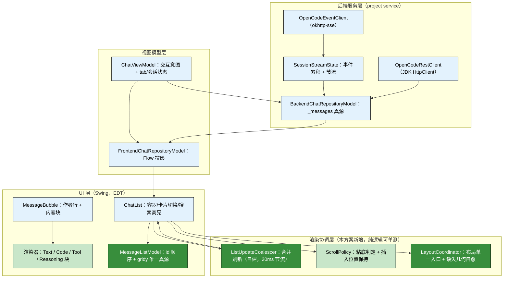

# TSD-30 会话面板整体优化方案

> 定位：本文是会话面板（主界面消息流）的**整体优化方案**，融合四路调研（平台官方文档 / 开源同类插件 / 工程质量实践 / 本仓代码审计）结论，给出分层目标架构、关键契约与分期实施计划。
> 关系：渲染细则见《TSD-07-主界面布局设计》§3.4，事件流与对账见《TSD-06-事件流接入设计》，输入区见《TSD-08-输入区与上下文交互设计》；本文**取代**散落在上述文档中的临时补救描述，冲突处以本文为准。

## 修订历史
| 版本 | 日期 | 变更说明 | 作者 |
|------|------|---------|------|
| v1.0 | 2026-09-30 | 初版：四路调研汇总 + 问题清单 + 分层目标架构 + 分期实施计划 | agent |
| v1.1 | 2026-09-30 | 新增 §9 附录：与《产品说明》诉求的差异对照（7 项缺口/降级、4 项待回填、2 项方向性分歧） | agent |
| v1.2 | 2026-09-30 | 决策落定：最低平台提升至 2026.2（`sinceBuild=262`，官方 `DebouncedUpdates` 转为可用，见 §1.3/§5.3/§7）；REST 与事件流统一到同一 OkHttp 客户端（新增 §5.9、Phase 2.7）；G1/G2 定为「0.1.0 阶段降级 + 后续阶段落地」（新增 Phase 4）；Phase 2 补思考过程折叠（G3）；§9 新增 §9.6 处置结果 | agent |
| v1.3 | 2026-10-01 | §5.3 合并刷新参数按实现定稿：`ListUpdateCoalescer` 落地为 20ms leading-edge 节流（后端已有 75ms 节流，前端只合并同一事件循环内的重复请求，不叠加端到端延迟），同步 §4.2/§5.3/§7 相关表述 | agent |

---

## 1. 背景与结论

### 1.1 背景

会话面板连续多轮以「单点补丁」方式修复，症状反复出现：消息区整片空白 → 内容被后一条消息冲掉 → 本地回声气泡重建闪烁 → 顺序颠倒。每次都能修好当次现象，但**下一轮又冒出同类问题**（`CHANGELOG.md:35-42` 连续 6 条修复记录，其中 3 条都属于「消息可见性/顺序」这一个主题）。

这说明问题不是某一行代码写错，而是**渲染层缺少明确的契约**：谁负责布局、什么时候布局、流式内容如何增量更新、滚动如何决策、组件生命周期归属谁，都没有成文约定，只能靠现场试错。

### 1.2 调研结论（三条核心判断）

| # | 判断 | 依据强度 |
|---|------|---------|
| **C1** | **保持纯 Swing 路线，不迁移 JCEF。** 官方明确「优先用平台默认 UI 框架（Swing），仅在需要展示 HTML 文档或标准做法不够时才考虑 JCEF」；纯 Swing 有规模化先例（Kilo Code 明确以「100% native Swing、无内嵌浏览器、无 Node」重写，原因是 webview 的手感/远程开发适配问题）；JCEF 路线已知翻车点包括实例内存大、macOS 滚动卡顿、OSR 下输入法与拖放失效、split mode 需专门适配，且 `MarkdownJCEFHtmlPanel` 社区报告在 IJ 2026.2 已移除 | 官方文档 + 社区源码注释 |
| **C2** | **消息列表采用「一消息一组件 + 条件粘底滚动 + 增量 patch + 合并刷新」。** 调研到的 AI 聊天面板（obiscr/ChatGPT、Kilo、CC GUI、Continue 前端）**无一使用 `JList` 虚拟化**；该场景特点是「条数有界（几十~几百）+ 高度可变 + 内嵌交互 + 局部流式更新」，`JList` 的优势用不上、劣势全踩。流式刷新统一做法是**合并节流**（CC GUI 用 50ms 窗口 + 增量 delta，结束时全量对账） | 多个开源项目源码 |
| **C3** | **布局必须建立「单一入口 + 显式契约」。** JDK 侧语义：`revalidate()` 是延迟校验、`validate()` 在 `peer == null`（未加入可显示层级）时**是空操作**、`doLayout()` 只跑本容器 layout manager 且不递归、`JScrollPane.isValidateRoot() == true`（是理想校验根）；官方论坛给 tool window 刷新范式是「原地增删 + `validate()` + `repaint()`」，并明确「不要把内容替换成新建的 panel 引用」。当前代码里散落的 `forceLayout(doLayout 递归)`、`scrollRectToVisible`、`invalidate/validate` 组合属于**未经契约化的现场对策** | JDK 源码 + 官方论坛 |

### 1.3 关键工程约束（既有决策，本方案不得违反）

| 约束 | 来源 | 对本方案的影响 |
|------|------|---------------|
| 主界面布局：顶部会话 tab + 中部消息流 + 底部输入工具条 | 项目约定（记忆 `mem_0da609e9`） | 架构分层保持「单 Content + 自绘 tab 栏」，会话面板需自管生命周期 |
| `sinceBuild = "262"`（2026.2，2026-09-30 由 261 提升） | `build.gradle.kts:120-124`（`pluginVerification` 目标同步改为 2026.2） | 平台 2026.2+ 的 API **可用**：官方 `DebouncedUpdates`（`@ApiStatus.Experimental` → 用薄封装隔离，行为不符可回退自建）；代价是放弃 2026.1 支持 |
| 单测栈：JUnit4 + Platform test framework，禁用 JUnit5 平台监听 | 项目规则（记忆 `mem_3edbd723`） | 不引入 Integration Tests（官方仅支持 JUnit5）；UI 断言走 Platform 测试框架 + `dispatchAllInvocationEventsInIdeEventQueue` |
| 验证流程：只编译 + 单测 + `buildPlugin`，不跑 `verifyPlugin` | 项目规则（记忆 `mem_40a0a880`） | 兼容性检查降级为「本地按最低版本编译」+ 发布前人工 `verifyPlugin`（可选项） |
| 依赖：事件流用 okhttp-sse（`opencode-backend` 已 `implementation`），不引三方 UI 库 | 项目约定（记忆 `mem_1b7a6703`）+ `opencode-backend/build.gradle.kts:6-8` | Markdown/富文本渲染能力自建，不引 flexmark/JCEF/Compose；**REST 亦统一到 okhttp**（§5.9），零新增依赖 |
| 凭据只走 PasswordSafe，不入日志 | 项目规则（记忆 `mem_66219c3d`） | 日志方案中明确「token/密码一律不落盘」 |

---

## 2. 现状问题清单（只读审计结论，附证据）

### 2.1 P0：确定性问题（稳定性 / 资源）

| # | 问题 | 位置 | 后果 |
|---|------|------|------|
| P0-1 | `StreamingRenderController` 在 `init` 中 `flushTimer.start()`，但 `dispose()` 无任何调用点；`ChatList.uiScope` 也无归属，`ChatList` 未实现 `Disposable` | `ChatList.kt:41,44,68-83,291`、`StreamingRenderController.kt:53-54,161-167` | 每次打开工具窗泄漏一个 `javax.swing.Timer`（EDT 定时器，75ms 空转）+ 一个永不取消的协程作用域 |
| P0-2 | 面板订阅（13 段 `collect + invokeLater`）挂在 **project 级** `CoroutineScopeHolder.createScope`，不随工具窗销毁取消 | `OpenCodeChatApp.kt:153-274`、`CoroutineScopeHolder.kt:31` | 反复开合工具窗会叠加 collector，旧 ViewModel 被持续订阅 → 状态串扰 + 内存增长 |
| P0-3 | `[diag]` 诊断日志仍以 **INFO** 打在热路径（每次 `setMessages` 打印消息清单 + 容器/视口几何 + 透传 13 条 child 几何） | `ChatList.kt:117-120,250-275,319-322`、`MessageItem.kt:54-57,657-660` | 流式期间每 75ms 一轮，`idea.log` 刷屏、EDT 上有字符串拼接与 I/O 开销 |

### 2.2 P1：体验与性能

| # | 问题 | 位置 | 后果 |
|---|------|------|------|
| P1-1 | `scrollToBottom()` 无条件执行（`scrollRectToVisible` 到底），无「用户是否已在底部」判断 | `ChatList.kt:238-247` | 用户上翻阅读历史时被强制拽回底部。调研的所有成熟实现都用 `isUserAtBottom` 判定，obiscr/ChatGPT 的 `setValue(maximum)` 被列为反面教材 |
| P1-2 | 流式更新重建整块：`updateStreamingText` 删除旧 contentContainer、重建、**硬编码插回 index 2**；思考气泡 `renderedContent` 初值 `""` 导致首帧必重建 | `MessageItem.kt:169-179,229-253,48,83-90` | 闪烁 + 高频创建重对象（`JBTextArea`/标签/markdown 分段） |
| P1-3 | UI 侧无合并刷新：每次消息发射都 `revalidate + 递归 doLayout(全量) + repaint` | `ChatList.kt:139-140,296-333` | 长会话卡顿；且 `forceLayout` 递归对所有子组件做全量布局 |
| P1-4 | 删除中间消息后剩余组件 `gridy` 不回写，`addNewMessages` 用「全表下标」作 `gridy`；`removeSpaceFillerIfPresent` 以「componentCount > bubbles.size」推断末位是 filler | `ChatList.kt:194-230` | 可能出现 gridy 冲突/重叠、误删气泡（属「内容消失」类故障的复发风险） |

### 2.3 P2：可维护性

| # | 问题 | 位置 |
|---|------|------|
| P2-1 | `MessageItem.kt`（765 行）平铺气泡/工具卡/代码块/分页/头像/markdown 解析；`ChatList.kt`（335 行）混卡片切换、diff、搜索高亮、滚动、布局、诊断日志 | `MessageItem.kt`、`ChatList.kt` |
| P2-2 | `BackendChatRepositoryModel.kt`（857 行）混 REST + SSE + 对账 + 本地模拟 + DTO 映射 + 会话管理 | `BackendChatRepositoryModel.kt` |
| P2-3 | 前端 UI（`ChatList`/`MessageBubble`/`StreamingRenderController`/`ChatViewModel`/前端仓库）**零单测** | `src/test/kotlin/...`（现有 13 个测试文件全在后端/契约/工具类） |
| P2-4 | 硬编码中文与色值：`MessageItem.kt:415,443-451,576,600,731-733` 等未走 bundle；警示色在 `PermissionPrompt.kt:86` 与 `ContextUsageIndicator.kt:39` 重复定义；多处行内 `JBColor(...)` | 见左列 |
| P2-5 | 死链路：`MessagePartDto` / `SessionStateDto.parts` / `getSessionStateFlow` 无消费者；`StreamingRenderController` 除 `cancelStreaming` 外无调用点 | `ChatRepositoryRpcApi.kt:30,47`、`dtos.kt:47-79`、`BackendChatRepositoryRpcApi.kt:50-76` |

### 2.4 已修复项（避免重复排查）

| 现象 | 处置 | 出处 |
|------|------|------|
| 消息区整片空白 | `refresh()` 内递归 `doLayout()` 强制同步布局（**临时对策，见 §6.1**） | `CHANGELOG.md:41`、`ChatList.kt:296-333` |
| 收到回复后列表看似被清空 | REST `data[]` 为「最新在前」，统一 `asReversed()` | `CHANGELOG.md:40`、`BackendChatRepositoryModel.kt:561-562` |
| 本地回声气泡重建闪烁 | 用 `/prompt` 响应的 user 消息 id 作气泡 id | `CHANGELOG.md:42`、`OpenCodeRestClient.kt:151` |

---

## 3. 目标与非目标

### 3.1 目标

1. **稳定性**：不再出现「消息不可见 / 内容被冲掉 / 顺序错乱」；同一会话的重连、终态对账、切 tab 都不改变可见结果。
2. **体验**：阅读历史不被打断；流式回复平滑（无闪烁、无明显掉帧）；长会话（数百条 + 长代码块）滚动可用。
3. **可维护**：职责边界清晰，UI 组件可单测；新增一种「消息块」只需加一个渲染器。
4. **可观测**：正常运行只留少量关键 INFO；诊断细节可按 category 开关；报障时能一键收集日志；凭据永不落盘。

### 3.2 非目标（明确排除）

- 不迁移到 JCEF / Compose / 第三方 UI 库（与 §1.3 依赖约束一致；C1 已论证）。
- 不引入 `JList` 虚拟化（C2 已论证性价比）。
- 不做多 IDE 版本矩阵与 Integration Tests（与既有验证流程约束一致）。
- 不改动顶部 tab / 输入区 / 设置页的交互形态（属 TSD-07/08 范围）。
- 不改服务端协议（`opencode` HTTP API 契约保持 TSD-06 既有结论）。

---

## 4. 目标架构

### 4.1 分层

要点（相对现状的变更）：
- **新增渲染协调层**（绿色）承载三件今天散落在 `ChatList` 里的隐式逻辑：合并刷新、粘底滚动、布局入口；这层不依赖 Swing，可纯逻辑单测。
- `A4 MessageListModel` 让「消息 id 顺序」成为布局的唯一真源（`gridy` 由它派生），消除 P1-4 的下标错配。
- 渲染器按块类型拆分（`A3`），使「加一种块」成为加法而非改 `MessageBubble` 的条件分支。

### 4.2 关键契约（本方案的硬性约定）

| 契约 | 内容 | 反面（禁止） |
|------|------|-------------|
| **C-布局** | 动态增删子组件后，**只允许**调用 `LayoutCoordinator.requestLayout()`；它内部对**校验根**（外层容器或 `JScrollPane`）执行 `revalidate()`，仅在「几何缺失」时补同步 `validate()`；所有布局保证集中在一次调用内 | 在业务代码里散落 `repaint()`、`doLayout()`、`revalidate()`；在渲染回调里逐个组件调布局 |
| **C-顺序** | 一条消息 = 一个稳定 id + 一个有序块数组（`text` / `reasoning` / `tool`）；列表顺序与「最早在前」一致；`gridy` 由 `MessageListModel` 的索引派生，增删后统一重排 | 以「数组下标」当布局槽位；以「组件总数 - 气泡数」推断 filler |
| **C-增量** | 流式只做「按 id 覆盖该条消息的指定块内容」；流结束/重连时**一次全量对账**（REST 权威） | 每个 delta 全量重建气泡；每个 delta 直接触发布局与滚动 |
| **C-刷新** | UI 刷新统一经 `ListUpdateCoalescer`（20ms leading-edge 节流：后端已有 75ms 节流，前端只合并同一事件循环内的重复请求，不叠加端到端延迟）；窗口内多次变更合并为一次布局 + 一次滚动判定 | 在事件回调里直接操作 Swing 组件 |
| **C-滚动** | 仅当「用户已在底部（阈值内）」时自动贴底；用户上滑期间不抢滚动；插入历史（分页加载）时保持视口锚点 | 无条件 `scrollRectToVisible` 到底 |
| **C-生命周期** | 每个会话面板 / 渲染控制器都有 `Disposable`，挂到 `Content.setDisposer(...)` 或 ViewModel 之下；定时器与协程 scope 在 `dispose()` 内释放 | 自建 `CoroutineScope` 不绑定 Disposable；`Timer` 常驻 |
| **C-主题** | 颜色只经 `JBColor.namedColor(...)`（或收敛到 `ChatAppColors`），间距/尺寸经 `JBUI.scale/insets`，文案经 `OpencodeFrontendBundle` | 行内 `Color(r,g,b)`、行内中文文案、裸 `Insets` |
| **C-日志** | 关键节点 INFO（会话切换、对账结果、连接状态、发送结果，数量级可查）；细节与几何用 `LOG.debug {}`；诊断开关走 Debug Log Settings 的 category；token/密码永不入日志 | 热路径 INFO 刷屏；打印凭据；`[diag]` 式临时日志长期驻留 |

---

## 5. 分项设计

### 5.1 布局：从「现场对策」到「单一入口」

**现状**：`refresh()` = `revalidate()` + `ensureLaidOut()`（检测到气泡宽度为 0 时递归 `doLayout()`）+ `repaint()`。其中递归 `doLayout()` 是实测对策（`Container.validate()` 在轻量组件 + `peer == null` 场景为空操作，见 TSD-07 §3.4），**不是官方路径**，且它绕过了 `isValid` 状态机。

**目标**：
1. 布局入口唯一：`LayoutCoordinator.requestLayout()`。
2. 内部顺序：对**校验根**（`JScrollPane`，`isValidateRoot() == true`）`revalidate()`；若本次变更需要立即拿到尺寸（紧接滚动判定），再对同一根 `validate()`。
3. **自愈兜底保留但收敛**：仅当「可见容器宽度 > 0 且存在子组件 bounds 为 0」时，才对该子树补一次同步布局——并把命中情况以 `LOG.debug` 记录（不再 INFO）。这类兜底是**技术债**，需由 §5.7 的布局断言测试覆盖，一旦确认根因消除即删除。
4. 禁止在 `MessageBubble` 内部自行触发列表级布局；气泡只更新自身内容并 `revalidate()` 自己。

**验收**：新增/删除/重排消息后，`MessageListModel` 声明的顺序与子组件 `bounds` 一一对应，且无零尺寸可见子组件（由 §5.7 用例断言）。

### 5.2 列表与滚动：粘底 + 锚点

**粘底判定**：`viewport.viewPosition.y + extentHeight >= viewSize.height - 阈值`（阈值取一行高度量级，`JBUI.scale`）。仅在为真时贴底。用户上滑（`AdjustmentListener` 记录最近一次滚动是否由用户发起）期间不打扰。

**插入锚点保持**：向上分页加载历史时，先记录当前首条可见消息 id 与其相对偏移，插入后按同一锚点还原视口（避免「加载更多后跳到别处」）。

**布局槽位**：`MessageListModel` 维护有序 id 列表；增删后按新顺序重设所有子组件的 `gridy`（或改为逐个 `remove/add` 后统一布局）。filler（`Box.createVerticalGlue`）**持有一个显式引用**，不再靠组件数量推断。

### 5.3 流式渲染：增量 + 合并

- **块级增量**：`MessageBubble.syncWith(message)` 已按「内容指纹」短路，保留；`updateStreamingText` 改为**复用现有内容容器**（文本块 `JBTextArea` 直接 `setText`/`document` 替换，代码块只替换代码文本并重算折叠行数），去掉「删除重建 + 硬编码 index 2」。
- **首帧防御**：思考气泡的 `renderedContent` 初值改为 `null`，null 时首次渲染不做「变更」判定，避免无谓重建。
- **合并刷新**（自建 `ListUpdateCoalescer`，官方 `DebouncedUpdates` 作为可选实现）：
  - 自建形态（已落地）：leading-edge 节流——距上次执行已过窗口期（20ms）才放行，否则合并跳过；放行时执行一次布局（`LayoutCoordinator.requestLayout()`）+ 一次滚动判定，保证「一次布局 + 一次滚动判定」的收口。组件不可见暂停（`forComponent` 语义）未实现，当前无此诉求。
  - 官方形态（`sinceBuild=262` 起可用）：`com.intellij.util.ui.update.DebouncedUpdates.forComponent(component, name, delay)` + `runLatest`，语义接近且由平台维护；但它标 `@ApiStatus.Experimental`，故**用薄封装 `ListUpdateCoalescer` 隔离**，一旦行为不符直接切回官方实现，调用方无感。
  - 参数定稿：20ms（后端 `SessionStreamState` 已有 75ms 节流，前端取更小值只合并同一事件循环内的重复请求，不叠加端到端延迟）。
- **结束态**：`ExecutionSucceeded/Failed/Interrupted` → 全量对账（已是现状），对账后**不改动可见顺序**，只覆盖内容与补齐缺失气泡。

### 5.4 生命周期与线程

| 事项 | 做法 |
|------|------|
| 面板级 scope | 每个会话面板持有 `Disposable`；`CoroutineScope(SupervisorJob() + Dispatchers.EDT)` 必须 `Disposer.register(panelDisposable, scope)`，`dispose()` 内 `scope.cancel()` |
| 订阅 | `OpenCodeChatApp` 改为使用**传入的** ViewModel 作用域（ViewModel 已由 `Disposer.register(toolWindow.disposable, viewModel)` 注册，`OpenCodeToolWindowFactory.kt:29`），不再用 project 级 `CoroutineScopeHolder` |
| 定时器 | 合并刷新用 `javax.swing.Timer`（EDT 上执行）或协程 `delay` 循环；两者都要在 `dispose()` 停止；删除未落地的 `StreamingRenderController` 中无用部分或补齐其 `dispose()` 调用链 |
| 线程注解 | 对 UI 入口方法加 `@RequiresEdt`（`com.intellij.util.concurrency.annotations`），配合 Plugin DevKit 的 ThreadingConcurrency 检查 |
| EDT 纪律 | 保持现状（所有 UI 更新经 `invokeLater`）；新增代码统一用 `withContext(Dispatchers.EDT)`（平台口径：协程里不要用 `invokeLater`） |

### 5.5 日志与可观测

- **正式日志（INFO）**：事件流连接/断开/重连、认证失败、REST 失败（method+path+code）、会话加载与对账结果（REST 条数 → 气泡条数）、发送结果（session、长度、消息 id、command）。**不打印**密码/token/完整请求体（凭据只在 `OpenCodeCredentials`/PasswordSafe）。
- **细节日志（DEBUG）**：几何信息、逐条 diff 结果、块级更新明细，统一走 `LOG.debug { ... }`（Kotlin 惰性块，避免白拼字符串）；放量的诊断不再用 INFO。
- **诊断开关**：定义插件自己的 category（`com.ayongw.idea.opencode` 前缀已具备），报障时让用户经 **Help | Diagnostic Tools | Debug Log Settings** 打开该 category 复现，再走 **Help | Collect Logs and Diagnostic Data** 收集。不需要在插件内自建「导出诊断包」功能（平台已提供）。
- **清理**：移除 `[diag]` 系列 INFO 与 `logGeometry` 的逐子组件 dump（P0-3）。

### 5.6 主题与样式

- 颜色：统一 `JBColor.namedColor(key, 默认值)` 或收敛进 `ChatAppColors`；移除行内 `JBColor(Color(...), Color(...))`（`SessionList.kt:333,344,352`、`PromptInput.kt:496`）与重复警示色（`PermissionPrompt.kt:86`、`ContextUsageIndicator.kt:39` 合并为一处）。
- 尺寸/间距：`JBUI.scale` / `JBUI.insets` / `JBUIScale`（`JBUI.scale(float)` 已废弃）；`MessageItem.kt` 中内联 `JBUI.scale(2)` 归入 `ChatUIConstants.Spacing`。
- 文案：`MessageItem.kt` 内中文（`上一页/下一页/展开 N 行/收起/工具名状态文案` 等）迁入 `OpencodeFrontendBundle`，与项目其余 UI 一致。

### 5.7 测试

| 层级 | 做法 | 门 |
|------|------|----|
| 纯逻辑（主） | 抽出 `MessageListModel`（顺序/增删/gridy 派生）、`ListUpdateCoalescer`（合并窗口/保留最后一次）、`ScrollPolicy`（粘底判定/锚点还原）、`MessageBlockParser`（markdown 分段与代码块识别、内容指纹）→ 全部 `UnitTest`，无 Swing 依赖 | 必过 |
| Swing 冒烟 | 用 Platform test framework（JUnit4）构造 `ChatList`，灌入消息序列后调 `PlatformTestUtil.dispatchAllInvocationEventsInIdeEventQueue()`，断言：① 子组件数量与顺序与模型一致；② 无「可见且 0 尺寸」子组件；③ 滚动位置符合粘底策略 | 必过（先小覆盖：3~5 个用例） |
| 流式回放 | 用既有 fixture（`src/test/resources/sse/*.txt`）驱动事件解析 → 状态机 → 断言最终气泡序列（顺序、块类型、工具状态） | 必过 |
| 性能冒烟（可选） | 用 `PlatformTestUtil.startPerformanceTest()` 对「N 条消息 + M 次流式合并刷新」做机器校准的 EDT 耗时断言，防止布局退化 | 建议 |

### 5.8 代码组织（拆分清单）

| 拆分项 | 现状 | 目标 |
|-------|------|------|
| `MessageItem.kt`（765 行） | 气泡 + 工具卡 + 代码块 + 分页 + 头像 + markdown | 拆为 `bubble/MessageBubble.kt`、`bubble/AuthorRow.kt`、`block/TextBlock.kt`、`block/CodeBlockPane.kt`、`block/ToolCallCard.kt`、`block/PagedTextPane.kt`、`md/MarkdownSegmenter.kt` |
| `ChatList.kt`（335 行） | 卡片切换 + diff + 搜索高亮 + 滚动 + 布局 + 诊断 | 拆为 `MessageListView.kt`（容器/卡片）、`MessageListModel.kt`、`ListUpdateCoalescer.kt`、`ScrollPolicy.kt`、`LayoutCoordinator.kt` |
| `ChatViewModel.kt`（615 行） | 消息/会话/tab/agent/model/usage/mention/workspace/permission 全混 | 按「会话组」与「输入组」拆出子状态持有者，`ChatViewModelApi` 收敛为聚合门面（接口 40+ 成员的瘦身目标：≤ 20） |
| `BackendChatRepositoryModel.kt`（857 行） | REST + SSE + 对账 + 模拟 + DTO 映射 + 会话 | 拆出 `EventStreamCoordinator`（事件→状态机）、`MessageMapper`（REST/SSE → 气泡）、`SessionCatalog`（会话列表/标题）、`LocalSimulator`（兜底） |
| 死代码 | `MessagePartDto`/`SessionStateDto.parts`/`getSessionStateFlow`/`StreamingRenderController` 残余 | 删除，契约同步收窄 |

> 拆分原则：**先补测试再动刀**（§5.7 的纯逻辑用例先行），每次拆分保持 `compile + test + buildPlugin` 绿。

### 5.9 通信层统一：REST 与事件流共用 OkHttp

**现状（三种传输并存）**：REST 主体走 `HttpURLConnection`、PATCH 单独走 JDK `java.net.http.HttpClient`（`OpenCodeRestClient.kt:523-534`）、事件流走 okhttp + okhttp-sse（`opencode-backend/build.gradle.kts:7-8`）。

**决策（2026-09-30）：统一到同一个 `OkHttpClient` 实例。**

1. **零新增依赖**：okhttp 4.12.0 已随插件打包（事件流必需），保留 JDK 传输并不省打包体积，却要维护第二套调用代码。
2. **一份配置**：Basic 认证（现有 `authHeaderValue()`）、connect/read 超时、代理、重试策略只需定义一次；当前 SSE 侧 `readTimeout=0`（长连接）与 REST 侧默认超时不一致，统一后差别显式声明在拦截器/单请求上。
3. **一致的错误语义与日志**：非 2xx 与异常统一映射为「method + path + code」日志，符合 §4.2 的 C-日志契约。
4. **测试栈一致**：`mockwebserver:4.12.0` 已在 test 依赖（`build.gradle.kts:113`）；现有 REST 单测用本地 `com.sun.net.httpserver`（`OpenCodeRestClientUnitTest.kt:38-53`）断言真实请求，**与传输实现解耦，迁移不改断言**。
5. **迁移面可控**：`OpenCodeRestClient.kt`（13 处传输调用，其中 PATCH 一处）、无其他调用方；事件流客户端已用 okhttp，不动。

> 排期见 Phase 2.7。迁移完成前不得在 REST 侧新增 JDK 传输调用。

---

## 6. 分期实施计划

### Phase 1（P0：稳定与资源，先做）

| 项 | 内容 | 影响面 |
|----|------|-------|
| 1.1 | 面板/渲染控制器生命周期补齐：`Disposable` 归属、Timer 与 scope 释放；删除 `StreamingRenderController` 无用残余 | `ChatList.kt`、`StreamingRenderController.kt` |
| 1.2 | 订阅改挂 ViewModel/面板生命周期，去掉 project 级 scope 复用 | `OpenCodeChatApp.kt`、`OpenCodeToolWindowFactory.kt` |
| 1.3 | 日志降噪：`[diag]` 全部移除或降 DEBUG；几何信息仅 DEBUG | `ChatList.kt`、`MessageItem.kt` |

**验收**：`./gradlew test buildPlugin` 全绿；连续开合工具窗 10 次后 `idea.log` 无重复订阅痕迹、无 `Memory leak detected` 告警；流式回复期间 `idea.log` 不再出现逐条几何行。

### Phase 2（P1：体验与性能，核心）

| 项 | 内容 | 影响面 |
|----|------|-------|
| 2.1 | 引入 `MessageListModel`（id 顺序 + gridy 唯一真源）与 filler 显式引用；删除路径同步重排 | `ChatList.kt` |
| 2.2 | `LayoutCoordinator` 单一布局入口；`forceLayout` 收敛为调试期自愈兜底 | `ChatList.kt` |
| 2.3 | `ListUpdateCoalescer` 合并刷新（20ms leading-edge 节流） | 新增 + `ChatList.kt` |
| 2.4 | `ScrollPolicy` 粘底判定 + 插入锚点保持 | `ChatList.kt` |
| 2.5 | 流式块级增量：复用内容容器、去掉硬编码 index 2、修思考气泡首帧重建 | `MessageItem.kt` |
| 2.6 | 布局与流式回放测试（§5.7 必过项） | `src/test/kotlin/...` |
| 2.7 | **通信层统一**（§5.9）：REST 迁移到与事件流共用的 `OkHttpClient`，删除 JDK 传输调用；`mockwebserver` 用例补齐 PATCH/超时/401 | `OpenCodeRestClient.kt`、`OpenCodeRestClientUnitTest.kt` |
| 2.8 | **思考过程折叠**（G3）：流式期间展开、结束后自动折叠（可手动切换），遵守 C-布局（折叠只调 `LayoutCoordinator`） | `MessageItem.kt` |

**验收**：装机验收清单 —— ① 连发 3 条消息不漏不吞不闪；② 收到回复时上翻阅读不被拽回底部；③ 300 条历史 + 长代码块会话滚动可用（无卡顿感知）；④ 切 tab 后回来内容与滚动位置符合预期；⑤ 断网重连后消息不重不乱。

### Phase 3（P2：可维护，尾做）

| 项 | 内容 |
|----|------|
| 3.1 | 前端 UI 拆分（§5.8 前两行） |
| 3.2 | 后端职责拆分与契约清理（§5.8 后两行） |
| 3.3 | 样式与文案归口（`ChatAppColors` / `ChatUIConstants` / bundle） |
| 3.4 | `ChatViewModelApi` 瘦身 |

**验收**：`compile + test + buildPlugin` 绿；单文件 ≤ 400 行；新增「一种消息块」只需加一个渲染器 + 一个用例。

### Phase 4（后续阶段：渲染升级 —— 兑现 PRD 选型）

> 决策口径（2026-09-30）：0.1.0 阶段**接受降级**（自研分段渲染、代码块无语法高亮），但 PRD 的 `JBHtmlPane` + `EditorTextField` 选型必须落地，否则「代码块与主编辑器一致」这一卖点不成立。

| 项 | 内容 | 验收 |
|----|------|------|
| 4.1 | 文本块改用平台 markdown → HTML（`org.jetbrains:markdown:0.7.3` 已在依赖但零引用，`build.gradle.kts:79`）+ `JBHtmlPane` 渲染；保留自研分段作为无 markdown 模块时的降级 | 链接可点击、行内 code/粗体/列表/标题正确；流式期间不整篇重解析 |
| 4.2 | 代码块改用只读编辑器（`EditorTextField` 或 `EditorFactory` 创建的只读 `EditorEx`）获得真实语法高亮 | 与主编辑器同一高亮与字体；**同屏/展开时才创建、移出视口即 `releaseEditor`**（数量受控，避免长会话爆内存） |
| 4.3 | 与 G2 的取舍复核 | 若 4.2 的内存与创建开销不可接受，需回到 PRD 显式回填「放弃语法高亮」并说明理由（**不允许沉默降级**） |

**验收**：装机对比「同代码块在聊天面板与主编辑器中的高亮一致性」；长会话（300 条含代码块）滚动无卡顿、编辑器实例数有上限且有序释放。

---

## 7. 风险与取舍

| 风险 | 说明 | 应对 |
|------|------|------|
| **`forceLayout(doLayout)` 的去留** | 它是实测有效但非官方的路径；若在 `LayoutCoordinator` 中过早移除，可能复现「整片空白」 | Phase 2 保留为「几何缺失才触发」的兜底并加 DEBUG 记录；由布局断言测试覆盖；**确认连续两个版本不再触发后才删除** |
| **合并刷新窗口与体感** | 窗口过大（>150ms）会显得卡顿，过小（<30ms）失去合并意义 | 先用 75ms（与后端节流对齐），用流式回放用例量化 EDT 占用与首字延迟后定参；参数集中在 `ChatUIConstants` |
| **Markdown 渲染能力弱** | 不引三方库与 JCEF，行内样式/表格/嵌套列表需自建 | 分两档：Phase 2 先保结构正确（段落、代码块、列表、行内 code/粗体），表格/图片等按需增补；不追求 GFM 全量 |
| **官方 `DebouncedUpdates`** | 平台 2026.2+ 且 `@ApiStatus.Experimental`；最低平台已提升至 2026.2 故可用，但仍可能随版本调整 | 用薄封装 `ListUpdateCoalescer` 隔离：优先官方实现，行为不符（如可见性暂停语义差异）直接切回自建，调用方无感（§5.3） |
| **拆分带来的回归面** | `MessageItem`/`ChatList`/`BackendChatRepositoryModel` 都是热点 | 先补测试（5.7）再拆；每次拆分单独提交，保持绿 |
| **`verifyPlugin` 不在本地流程** | 可能出现新 API 的兼容性漏检 | 新增 API 前在本地 SDK（最低支持版本 2026.2）确认存在；发布前人工跑一次 `verifyPlugin`（`pluginVerification` 目标已同步改为 2026.2） |

---

## 8. 参考来源

**平台官方**
- Threading Model / General Threading Rules / Coroutine Dispatchers / Coroutine Scopes：https://plugins.jetbrains.com/docs/intellij/threading-model.html ，https://plugins.jetbrains.com/docs/intellij/coroutine-dispatchers.html
- Tool Windows（Content、关闭 tab、`ToolWindowManager.invokeLater`）：https://plugins.jetbrains.com/docs/intellij/tool-windows.html
- Embedded Browser (JCEF)（官方「优先 Swing」口径、`JBCefApp.isSupported`）：https://plugins.jetbrains.com/docs/intellij/embedded-browser-jcef.html
- Lists and Trees / 长列表与 renderer 复用：https://plugins.jetbrains.com/docs/intellij/lists-and-trees.html
- Debouncing and Batching Updates（2026.2+）：https://plugins.jetbrains.com/docs/intellij/debounced-updates.html
- IDE Infrastructure（Logging）、Error Reporting、Testing（Testing FAQ / Light & Heavy Tests）：https://plugins.jetbrains.com/docs/intellij/ide-infrastructure.html ，https://plugins.jetbrains.com/docs/intellij/testing-faq.html
- UI FAQ（颜色/边框/主题）、UI Guidelines - Layout：https://plugins.jetbrains.com/docs/intellij/ui-faq.html ，https://plugins.jetbrains.com/docs/intellij/layout.html
- Disposers and Disposable：https://plugins.jetbrains.com/docs/intellij/disposers.html
- 排查 UI freeze（官方博客）：https://blog.jetbrains.com/platform/2025/09/investigating-intellij-platform-ui-freezes/

**JDK / Swing 语义**
- `Container.validate/validateTree/doLayout`：https://docs.oracle.com/en/java/javase/21/docs/api/java.desktop/java/awt/Container.html
- `JScrollPane`（`isValidateRoot`、Scrollable 决定 view 尺寸）：https://docs.oracle.com/en/java/javase/21/docs/api/java.desktop/javax/swing/JScrollPane.html
- Solving Common Layout Problems（「加了组件不显示」→ `revalidate()` + `repaint()`）：https://docs.oracle.com/javase/tutorial/uiswing/layout/problems.html
- 官方论坛「How to refresh Tool Window」（`validate()+repaint()` / `Wrapper.setContent`）：https://intellij-support.jetbrains.com/hc/en-us/community/posts/360003504680-How-to-refresh-Tool-Window

**开源同类项目**
- Kilo Code（纯 Swing 重写，无 webview / 无 Node）：https://plugins.jetbrains.com/plugin/28350-kilo-code ，https://blog.kilo.ai/p/kilo-code-goes-native-on-jetbrains
- Continue（JCEF 路线的一手工程细节：大消息分片、加载时序、browser 重建逃生）：https://github.com/continuedev/continue
- CC GUI（流式增量 + 50ms 合并 + 结束全量对账 + 粘底判定，含 `webview/src/ARCHITECTURE.md`）：https://github.com/zhukunpenglinyutong/jetbrains-cc-gui
- obiscr/ChatGPT（一消息一组件 + `VerticalLayout` + `JBScrollPane` 骨架；其无条件贴底与 trust-all SSL 为反面参考）：https://github.com/obiscr/ChatGPT
- Sourcegraph Cody（webview 分层与编辑器 tab 形态，已归档快照）：https://github.com/sourcegraph/cody-public-snapshot
- 对话数据模型参考（parts 有序数组、增量 + 终态对账）：https://vercel.com/blog/ai-sdk-5

**明确未证实项（实现前需在本地 SDK 核对）**
- `MarkdownJCEFHtmlPanel` 在 IJ 2026.2 是否已移除（社区报告，未取到官方源码路径）。
- `com.intellij.ui.JBHtmlPane` 的包路径与推荐度（官方论坛提及，未在官方文档确认）。
- 「合并刷新窗口」无官方统一出处（官方示例量为 300~500ms）——本项目按后端 75ms 节流定 20ms leading-edge（只合并同一事件循环内的重复请求，不叠加端到端延迟）。

---

## 9. 附录：与《产品说明》诉求的差异对照

对照对象：`docs/prd/产品说明.md`（PRD）与 `docs/tech/技术方案.md`（原始技术方案）。核对方式：逐条诉求 → 现状代码证据 → 本方案覆盖情况。

### 9.1 方向一致项（本方案是 PRD 原则的落地，不是另起方向）

| PRD 诉求 | 出处 | 现状 | 本方案 |
|---|---|---|---|
| 纯 Swing 原生 UI，不用 JCEF | PRD §一/§二 | 纯 Swing | C1 一致（并用开源先例加固了理由） |
| 协议驱动，插件端只做「状态镜像」 | PRD §一 | REST 权威 + SSE 补 + 对账 | 沿用，未改契约 |
| 状态与渲染分离 | PRD §一 | 分层存在但边界糊（`ChatList`/`ChatViewModel` 职责粘连） | §4/§5.8 显式补齐分层与边界 |
| 一消息一组件 + `JBScrollPane` 垂直容器 | PRD §4.3 | 已如此 | C2 一致（并用调研否掉 JList 虚拟化） |
| 流式 75ms 批量刷新、首帧立即创建、结束 final flush | PRD §4.4 | 后端 75ms 节流已有；UI 侧无合并 | §5.3 一致 + 把合并刷新补到 UI 侧 |
| 权限确认内联卡片（非模态，三按钮） | PRD §4.3 | `PermissionPrompt` 已实现 | 沿用 |
| 输入区（`JBTextArea` + 历史 `JBPopup` + Ctrl/Shift+Enter + 上下文标签） | PRD §4.3 | 已实现（TSD-08 范围） | 沿用 |
| SSE 不可信 → 定期 REST 对账 | PRD §4.2/§五 | 已实现（终态 + 重连对账） | 沿用并纳入「刷新契约」 |

### 9.2 缺口与降级项（PRD 有，现状与本方案都缺/弱）

| # | PRD 诉求 | 现状证据 | 差异类型 | 建议动作 |
|---|---------|---------|---------|---------|
| G1 | **富文本渲染用 `JBHtmlPane` + `org.jetbrains:markdown` 转 HTML**（PRD §二、§4.3） | 前端**零** `JBHtmlPane` 引用；`parseMarkdownWithCodeBlocks` 为手写分段（`MessageItem.kt:454-487`）；`org.jetbrains:markdown:0.7.3` **已声明依赖但全仓零引用**（`build.gradle.kts:79`） | **降级**（PRD 选型未落地） | Phase 2 起改为「平台 markdown → HTML → `JBHtmlPane`」渲染文本块；若坚持自建需在 PRD 显式回填降级理由 |
| G2 | **代码块用 `EditorTextField`，拿 IDE 原生语法高亮**（PRD §二/§4.3，明确写为「相比 WebView 的天然优势」） | `CodeBlockPane` 自绘（等宽字体，无语法高亮，`MessageItem.kt:619-729`） | **降级（且是产品差异化卖点）** | 二选一：① 按需创建只读 `EditorEx`（同屏/展开时创建、移出视口 `releaseEditor`）——保住卖点但需控数量；② 正式放弃并回填 PRD。**不可默认沉默** |
| G3 | **思考过程可折叠：流式期间展开、结束后自动折叠**（PRD §4.3） | 无 `CollapsiblePanel`；reasoning 平铺常显 | 缺口 | 列入 Phase 2 交互项（与合并刷新同一批） |
| G4 | **进程管理：`OSProcessHandler` 启动/复用 `opencode serve`、健康检查、优雅终止（`killProcessTree`）、启动失败重试 + 手动配置入口**（PRD §4.1/§五） | 全仓无 `OSProcessHandler`/`GeneralCommandLine`（零实现）；用户当前**手动启动 server 并手填地址 + 密码** | **缺口（范围性，且现实已暴露）** | **已立项并实现**：见《TSD-31-进程与连接管理方案》（发现与复用、就绪探测、凭据接入、引用计数终止、自愈、状态条与 CLI 引导），落地状态见其 §14 |
| G5 | **OpenCode 版本升级隔离**（锁定 SDK + 适配层隔离，PRD §五） | REST/事件解析分散在 `OpenCodeRestClient`/`OpenCodeEventParser`，无显式适配层边界 | 缺口（弱） | Phase 3 拆分时抽出 `OpenCodeApiAdapter`（版本感知的协议适配层） |
| G6 | **上下文注入含 PSI 语义分析**（PRD §4.5，「可利用 PSI 替代纯文本匹配」） | 现状为 mention/上下文芯片；PSI 深度未见 | 待确认（属 TSD-08 范围） | 在 TSD-08 中对齐，本方案不重复定义 |
| G7 | **UI 资产复用：状态管理逻辑独立成模块，为「第二阶段独立形态」复用**（PRD §五末，PRD 自评最大隐性风险） | `opencode-backend` 已独立模块，但 857 行单类混 REST/SSE/对账/模拟/DTO 映射 | 缺口（方向一致、需强化） | §5.8 拆分时以「可脱离 IDE 复用」为验收条件（backend 不依赖 frontend UI 类型） |

### 9.3 待回填项（PRD / 技术方案描述已被后续决策取代）

| # | 文档中的旧描述 | 实际 | 处理 |
|---|---------------|------|------|
| R1 | 「`JBSplitter` 左会话列表（`JBList`）+ 右对话面板」（PRD §4.3/§三） | 现为**顶部会话 tab + 中部消息流 + 底部输入条**（用户后定约定，见 TSD-07）；旧 `SessionList` 仍并存仅作弹窗内容 | PRD 回填为 tabs 形态；并决策旧 `SessionList` 去留（审计 P2 记为两套并存） |
| R2 | 「`DebouncedUpdates` 可作 `javax.swing.Timer` 替代」（PRD §4.4） | 立项期：`sinceBuild = "261"`（2026.1），该 API 自 2026.2 起且 `@ApiStatus.Experimental` → 当时不可用 | **已于 2026-09-30 解决**：最低平台提升至 2026.2（`sinceBuild=262`），API 转为可用（自建合并器保留为降级），见 §9.6 |
| R3 | 「单测 JUnit 5 + MockK；集成 `runIde` + TestFixture」（技术方案 §7） | 实际 JUnit4 + Platform test framework，无 MockK，且不跑 `verifyPlugin` | 回填技术方案 §7，与本方案 §5.7 对齐 |
| R4 | 「状态模型 `MessagePart` / `SessionState.parts`」（技术方案 §3.6.1） | 该链路无消费者（死代码）；实际为 `ChatMessage` + 工具块 | 删除死链路并回填模型描述（本方案 §2.3 P2-5 已列） |

### 9.4 本方案相对 PRD 的增强项

- **布局契约**（§4.2 C-布局/C-顺序）：PRD 未涉及，但这是当前「空白/消失/闪烁」反复复发的根因所在。
- **刷新与滚动契约**（C-刷新/C-滚动）：PRD 只有「75ms 批量」，未定义「用户上滑不打断」与合并窗口的落地方式。
- **生命周期与资源契约**（C-生命周期）：PRD 只覆盖了 server 进程的释放，未覆盖 UI 侧 Timer/协程/订阅（现状 P0-1/P0-2 正是此处泄漏）。
- **可观测性契约**（C-日志）：PRD 未定义日志分级与敏感信息边界。
- **前端可测性**（§5.7）：PRD/技术方案的测试策略全在后端，前端 UI **零单测**是当前最大盲区。

### 9.5 结论

1. **主干方向没有冲突**：本方案的三条核心判断（C1 纯 Swing、C2 一消息一组件 + 粘底滚动 + 增量 + 合并、C3 布局契约）与 PRD 的「纯 Swing / 状态渲染分离 / 协议驱动」一致，本方案是把 PRD 的**原则**落成**可执行契约**。
2. **真正的方向性分歧只有 2 处**，都需要产品侧拍板，而不是工程侧自行取舍：
   - **G1/G2 渲染载体**：PRD 要 `JBHtmlPane` + `EditorTextField`（拿到 IDE 原生语法高亮），现状是自研分段渲染。这不只是实现细节——它决定「代码块是否与主编辑器一致」这一**卖点是否成立**。
   - **R1 会话组织形态**：PRD 的左侧列表已被顶部 tab 取代，需回填以免两文档长期互相矛盾。
3. **最大的范围缺口 G4（进程与连接管理）已补齐**：PRD 用整章（§4.1 + 风险两项）描述插件应自己拉起并守护 `opencode serve`，立项期为零实现（用户手动起 server、手填地址与密码）。已按「会话面板」边界外单独立项并实现，见《TSD-31-进程与连接管理方案》§14。
4. 建议动作顺序：先回填 R1/R2（文档一致性，零成本）→ 决策 G1/G2（影响 Phase 2 渲染实现）→ Phase 1 照旧执行（P0 与 PRD 无冲突）→ G4 立项排期。

### 9.6 处置结果（2026-09-30 决策落地）

| 编号 | 决策 | 落地位置 | 状态 |
|------|------|---------|------|
| R1 会话组织形态 | 保留现形（顶部 tab），**回填 PRD** | `docs/prd/产品说明.md` §三/§4.3 + 修订历史 v1.1 | ✅ 已回填 |
| R2 `DebouncedUpdates` | **最低平台提升至 2026.2（`sinceBuild=262`）**，该 API 转为可用 | `build.gradle.kts:120-133` + PRD §二/§4.4 + 本文 §1.3/§5.3/§7 | ✅ 已落地 |
| R3 测试策略 | **回填技术方案**为 JUnit4 + Platform 框架、不跑 `verifyPlugin` | `docs/tech/技术方案.md` §7 + 文档状态改为「历史草案」 | ✅ 已回填 |
| R4 `MessagePart` 模型 | **标注废弃 + 回填真源**，清理任务保留在 §2.3 P2-5 | `docs/tech/技术方案.md` §3.6.1 | ✅ 已回填（清理待 Phase 3） |
| G1+G2 渲染载体 | **0.1.0 阶段接受降级，后续阶段必须落地**（不允许沉默降级） | 本文 Phase 4 + PRD §二实施状态 | ✅ 已登记，Phase 4 执行 |
| G3 思考过程折叠 | 列入 Phase 2.8 | 本文 Phase 2 | ✅ 已排期 |
| G4 进程与连接管理 | **先出方案、独立落地**（可在单独会话或子 agent 并行执行） | 新增《TSD-31-进程与连接管理方案》 + `opencode-backend/.../server/`、`chatApp/ui/ServerStatusStrip.kt`、设置页「Server 管理」分组 | ✅ 已实现（T1–T13；提交 `8cab69f`/`970e574`/`454e8fd`，落地状态见 TSD-31 §14） |
| G5 协议适配层 | 随 Phase 3 拆分抽出 | 本文 §5.8 | ✅ 已登记 |
| G6 PSI 上下文 | 归 TSD-08 范围 | 待在该文档对齐 | ⏳ 待办 |
| G7 UI 资产复用 | 拆分验收条件（backend 不依赖 frontend UI 类型） | 本文 §5.8 | ✅ 已登记 |
| 传输统一（用户提出） | REST 与事件流统一到同一 OkHttp 客户端 | 本文 §5.9 + Phase 2.7；《TSD-06》§2/§3 同步 | ✅ 决策已落，Phase 2.7 执行 |